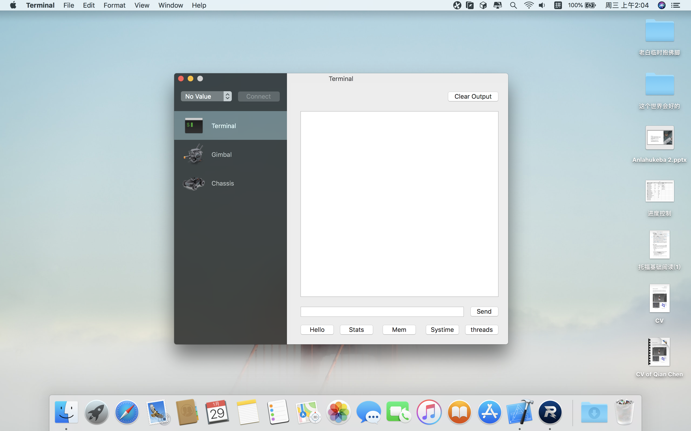
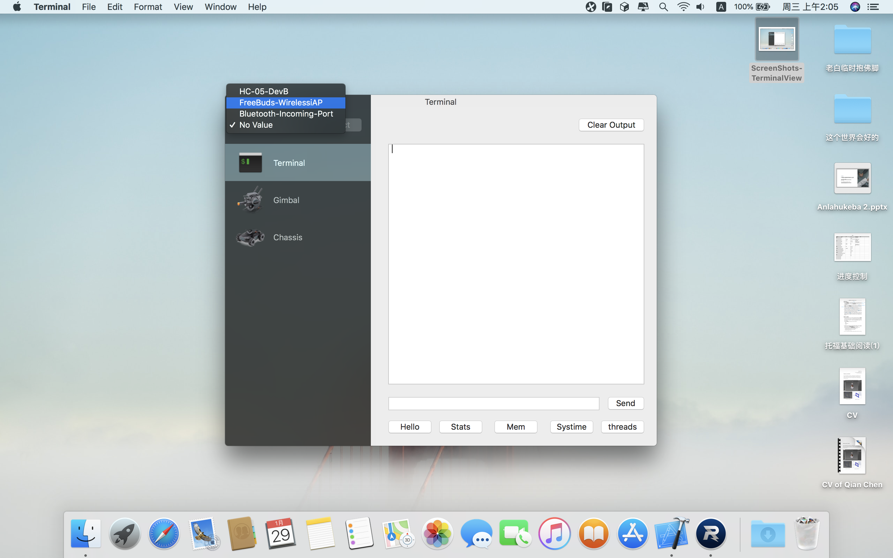
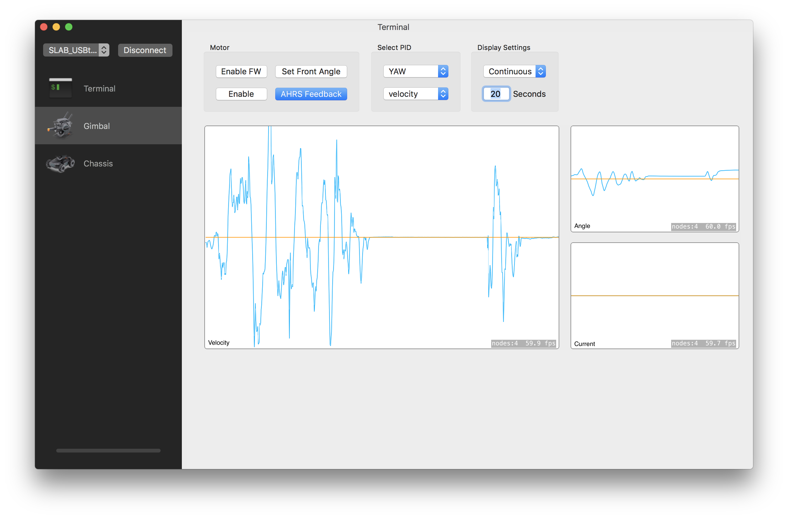
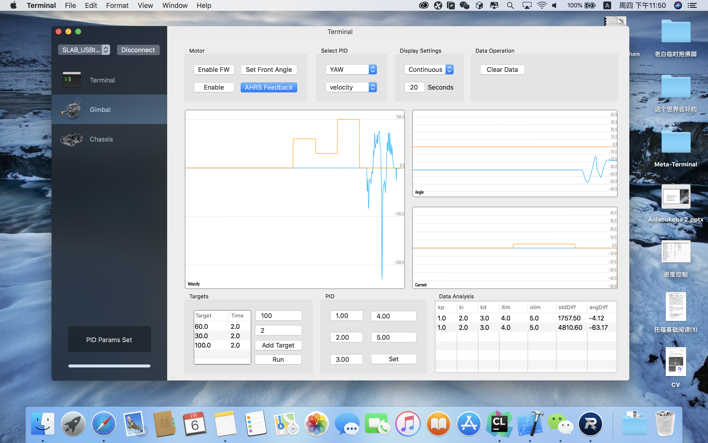
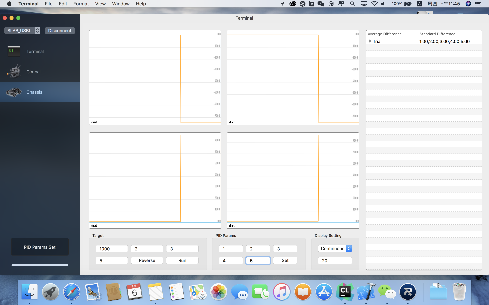
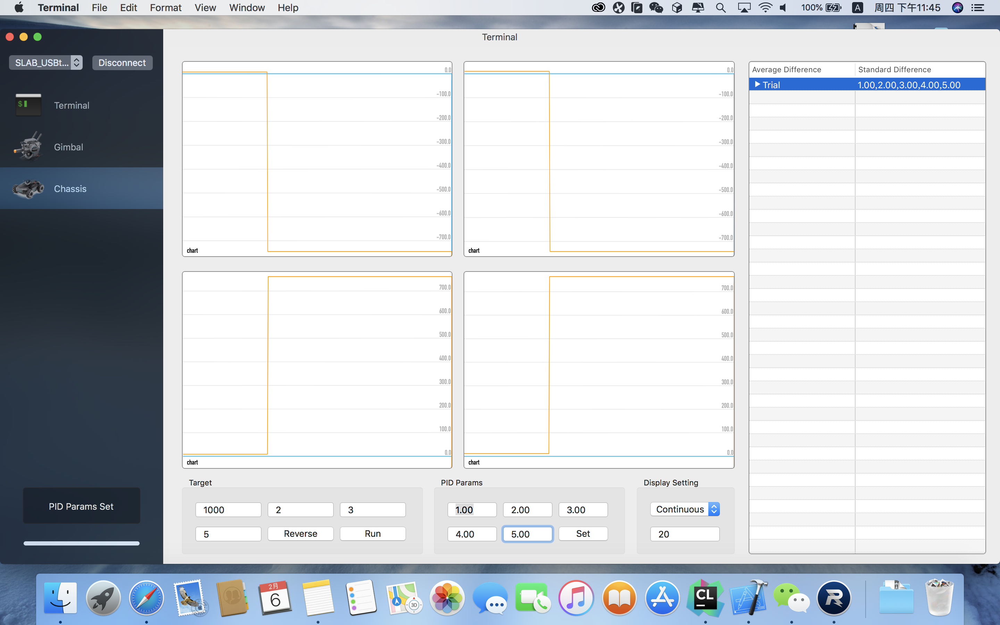

# Meta_Terminal_Rebuild
Using Xcode with Swift to rebuild the original meta_terminal (Matlab)
With Apple's Spritekit, the plot render speed is faster. Now meta-terminal could plot the data at `60 fps`.

remember `git submodule update --init --recursive` to get ORSSerial Module

## ScreenShots

The available ports will show in this button and could be selected.

Gimbal Plot. In target table, now we could drag to reorder, and press "delete" to delete item. In PID result table, click on the Cell will Reload PID params to text field automatically.

Chassis Plot. In PID result table, click on the Cell will Reload PID params to text field automatically. Click on the small triangle in the left of the cell could unfold the view and show four motors standard devation and average difference.

## Tasks

### Main Frame
- [x] Setting Up Project

- [x] UI Framework

- [x] Connect Button

- [x]  Real time rx message show

- [x] Fix the command timeout problem (Command Sent but ORSSerial does not recieve, did not appear in minicom nor old meta-terminal using matlab)

- [x] Build Terminal

- [x] Setting up different view

### Gimbal
- [x] Gimbal PID Params Setup

- [x] Gimbal Curve

### Chassis
- [x] Chassis Motor PID Params Setup, respectively

- [x] Chassis Curve

### AHRS
#### Will be added after refactor. (Maybe several month later.)
- [ ] AHRS Params Setup

- [ ] AHRS Graph

## Funny things
I'm a green hand. (1:05AM, 9/6/2019)
And I think I'll be late for tomorrow's registration. (1:18AM, 9/6/2019)

Trying to refactor the whole framework with swift. But still trying. (15:47, 1/27/2020)
